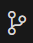
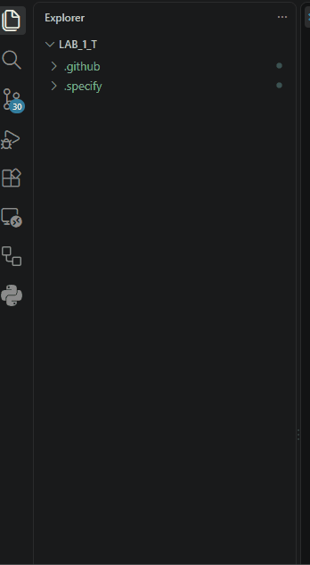

#### The Constitution should reflect the following criteria:

> An API first Specification - Use only known and documented APIs   
> Zero Known Vulnerabilities - Do not introduce vulnerabilities for the sake of convenience   
> Structured Observability by Default - Every action will produce a log   
> POC Simplicity (YAGNI) - You Aren't Gonna Need It - Don't add fluff and unnecessary features   
> Cross-Platform File Paths: The service MUST run on both Windows and Linux/macOS. Never hardcode slash characters (/ or \\) in file paths or script checks; always use the built-in path and url modules.  
> Secure Auth & Secret Hygiene    
> ---

??? code "Copy this prompt into the AI Agent interaction"
    ```md
    /speckit-constitution

    Create a constitution for the BYOC Middleware project that establishes non-negotiable principles for development and compliance.

    The project is a Node.js backend service that bridges Webex Messaging to Webex Contact Center. It must be production-ready, observable, and maintainable.

    Define these core principles:

    1. **API-First Specification**: All integrations with external services (Webex, WxCC) MUST validate every endpoint against the official published OpenAPI specification located at https://github.com/webex/webex-openapi-specs before any code is written. Endpoint URLs and spec source links MUST be documented in code comments. Any deviation from the published spec MUST be explicitly approved and filed in `deviations.md`.

    2. **Zero Known Vulnerabilities**: All npm dependencies MUST pass `npm audit --audit-level=moderate` with zero findings before being merged. Transitive vulnerabilities rated Medium or higher MUST be resolved or the feature deferred.

    3. **Structured Observability by Default**: Every API call, state transition, error, and significant decision MUST produce a JSON log entry containing: timestamp, operation name, outcome (success/failure), relevant identifiers, and error context. Silent failures are not acceptable.

    4. **POC Simplicity (YAGNI)**: The middleware is a proof of concept. Complexity must be justified by a concrete current requirement. No premature abstraction, plugin architectures, or speculative generalization.

    5. **Secure Auth & Secret Hygiene**: Authentication MUST use official Webex OAuth/token guidance, and credentials/secrets MUST be injected through environment-based configuration with strict redaction in logs and artifacts.
    6. **Cross-Platform File Paths**: The service MUST run on both Windows and Linux/macOS. Never hardcode slash characters (/ or \) in file paths or script checks; always use the built-in path and url modules.

    Include development workflow requirements, governance procedures, and version management. Use semantic versioning for amendments.
    ```


#### Allow the Agent to create the Constitution and then review the output.
> Navigate to .specify/memory/constitution.md  
> Open the file in preview mode
>
> ---

#### Commit the changes to your repository
This will allow you to easily identify the changes which are made as you progress through the project as well as let you revert to a previous point in the code history.  
> Click the Source Control button in the left menu   
> Click the `+` next to Changes to add all changes to the commit  
> Add a commit message: <copy>Constitution Created</copy>   
> Click the Commit button  
> Return to the Explorer  
> ??? gif w50 "Show Me"
     
> ---