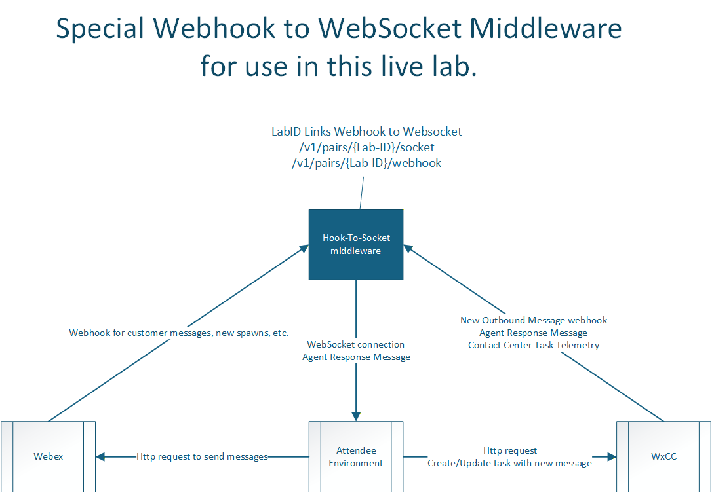

## What you will be building

In this lab you will be building a Bring Your Own Channel(BYOC) integration which will use Webex as an inbound channel to the Webex Contact Center.  You will be using publicly accessible documentation in conjunction with Webex APIs and a Webex Bot to create the specification which will be used to build out your middleware.  During this live lab, you will also be integrating with a hosted middleware which will accept Webhooks and forward the messages via a WebSocket so that you do not need to have a publicly accessible IP address/URI configured during the live lab.

---

## Review the details

- Connecting Webex Messaging to Webex Contact Center as an Inbound channel
- Webex users will create a new message with a Webex Bot account
- The middleware you are building will create a new task in the Webex Contact Center
- Messages will be passed back from Webex Contact Center to your middleware, which will route the message to the user’s Webex Message via the Webex Bot Account
- New messages from the Webex User will be sent to the Webex Contact Center task

---

## Primary Documentation
[Review this document](https://developer.webex.com/webex-contact-center/docs/bring-your-own-custom-messaging-channel){:target="_blank"} for the implementation details and requirements to build your own integration.

??? info "Webhook to WebSocket Middleware Diagram"
    

---

