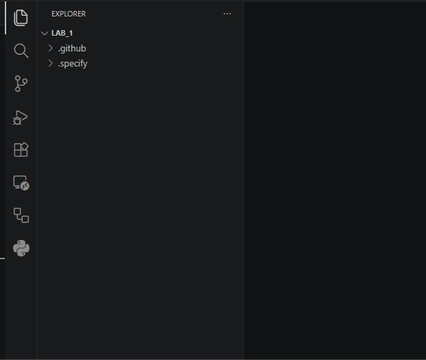

#### Open the Terminal and Navigate to the Downloads Folder  
> Press Key Combination: Windows Key + R  
Enter command: <copy>powershell</copy>  
Enter command: <copy>cd Downloads</copy>
> ---

#### Install Spec Kit

> Enter command: <copy>uv tool install specify-cli</copy>  
> 
> ---

#### Create the Project
> Enter command: <copy>specify init LAB_1</copy>  
> Select: copilot  
> Select: ps (PowerShell)  
> ---

#### Navigate Into the New Folder and Open VS Code
> Enter command: <copy>cd LAB_1</copy>     
> Enter command: <copy>code .</copy>   
>
> ---

#### Initialize a Git repository
> Click the Source Control Icon in the Left Pane   
> Click the Initialize Repository Button
> ??? gif w50 "Show Me"
>     
> ⚠️ Do **NOT** commit at this point!  
> 
> ---