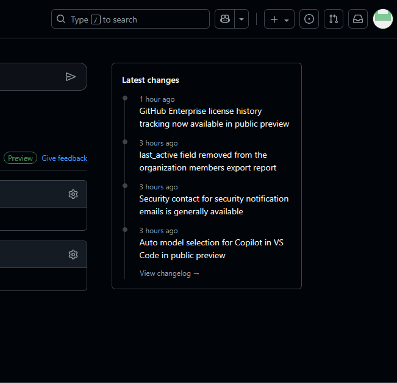

## Log into Your Personal Github Account  
> Navigate to [GitHub](https://github.com){target="_blank"}  
> Create a new GitHub account if you do not already have one.  
>
> ---

## Create a New Repository
> ??? gif w50 "In the upper right corner , click on the `+` menu then select New Repository"
    
> Fill in the details:  
>> Repository Name: <copy>Wx1-BYOC-Middleware</copy>  
>> Choose visibility: Private  
>> Add README: False  
>> Add .gitignore: No .gitignore  
>> Add license: No License  
>
> Click Create repository   
> Leave this tab open for use in future steps  
> 
> ---

> <form id="info">
<label for="info">Enter your GitHub Account Information</label> 
  <label for="gh">GitHub Account:</label>
  <input type="text" id="gh" name="gh"> 
    <label for="ghEmail">GitHub Email Address:</label>
  <input type="text" id="ghEmail" name="ghEmail"> 
  <button onclick="setValues()">Update Lab Guide</button>
</form>

## Update Git settings on the lab PC
> In the terminal of VS Code enter the following commands one at a time:  
> <copy>git config user.email "<w class="ghEmail"><w/>""</copy>  
> <copy>git config user.name "<w class="gh"><w/>""</copy>
>
> ---

## Push Your Code
> In the terminal of VS Code enter the following commands one at a time:  
> <copy>git remote add origin https://github.com/<w class="gh">{githubAccount}</w>/Wx1-Web-Components.git</copy>   
> <copy>git push -u origin main</copy>  
>
> ---